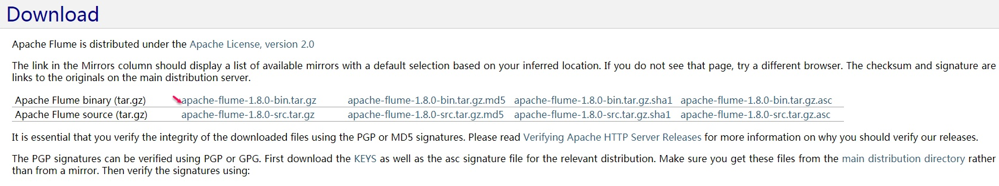
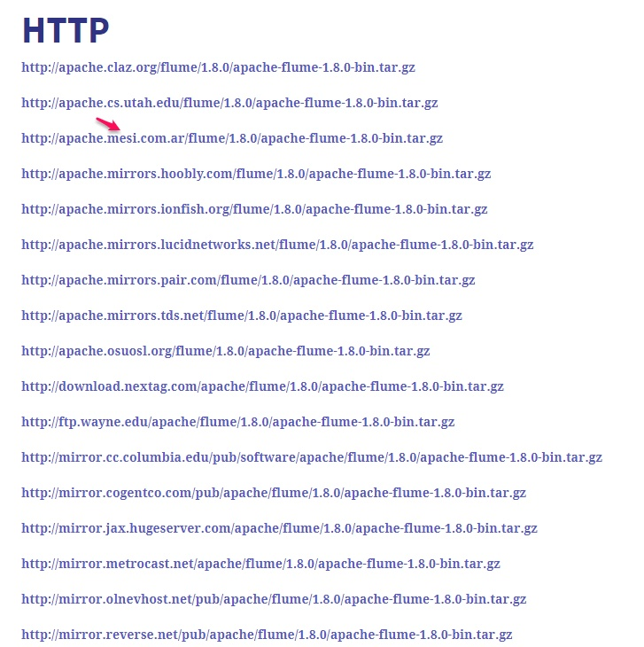

### 安装：
首先需要安装jdk，对于jdk版本冲突问题后面有解决方法

[下载Flume](http://flume.apache.org/download.html)  
&emsp;
   


``` bash
第三个地址亲测可用
wget 'http://apache.mesi.com.ar/flume/1.8.0/apache-flume-1.8.0-bin.tar.gz' --下载
tar -xzvf apache-flume-1.8.0-bin.tar.gz  --解压
mv apache-flume-1.8.0-bin flume-1.8.0   --重命名
```

### 配置

``` bash
    cd /opt/app/flume-1.8.0
    vim flume-1.8.0/conf/flume2kafka.conf  --加个配置，名字随意 因为启动的时候要指定配置文件的,这里用的是flume2kafka.conf

```

###### 写入 flume2kafka.conf
``` bash
a1.sources=r1

a1.channels=c1

a1.sinks=k1

a1.sources.r1.type=exec

a1.sources.r1.command=tail -F /opt/logs/gmmservice/auditlog/csos_audit.log

a1.sources.r1.channels=c1

a1.channels.c1.type=memory

a1.channels.c1.capacity=10000

a1.channels.c1.transactionCapacity=100

a1.sinks.k1.type = org.apache.flume.sink.kafka.KafkaSink

a1.sinks.k1.topic = test

a1.sinks.k1.brokerList = 106.15.225.114:9092

a1.sinks.k1.requiredAcks = 1

a1.sinks.k1.batchSize = 20

a1.sinks.k1.channel = c1
```
##### 解释一下:
``` bash
a1.sources.r1.command=tail -F opt/log/auto.log ---日志地址
a1.sinks.k1.topic = test         -----改成自己的topic名字，我的是test
a1.sinks.k1.brokerList = 106.15.225.114:9092  ----kafka地址，集群配置可以用逗号隔开
```

##### JDK版本冲突怎么办
对于jdk版本冲突问题 需要在flume 根目录下 copy一份对应版本的jdk，启动时指定Java_home即可  

### 启动脚本
为了方便我们加一个启动脚本
``` bash
flume 根目录下 vim start.sh 键入：

JAVA_HOME=/opt/app/flume-1.8.0/jdk1.8.0_101

export JAVA_HOME

echo "jdk -> $JAVA_HOME"

PATH=/opt/app/flume-1.8.0/jdk1.8.0_101/bin:$PATH

export PATH

echo "path -> $PATH"

bin/flume-ng agent -n a1 -c /opt/app/flume-1.8.0/conf -f /opt/app/flume-1.8.0/conf/flume2kafka.conf   >> console.log 2>&1 &


```
##### 解释一下：  
* flume2kafka.conf 是自己写的配置，名字是之前配置的对应   
* console.log 写入启动日志的文件  
* 上面的地址注意要替换成自己flume 和jdk的路径，如果没有jdk版本冲突问题        只需要最后一条语句即可  

##### 执行启动脚本

``` bash
chmod -R 777 /opt/app/flume-1.8.0   ---给所有用户授读写运行的权限 -R表示递归授权
sh ./start.sh ---启动
ps -ef |grep flume  ---查看是否启动成功
tail -f /log/flume.log  ---查看flume日志
tail -f console.log     ---查看启动日志

```

### 测试
到kafka 测试一下消费者：  

``` bash
bin/kafka-console-consumer.sh --bootstrap-server localhost:9092 --topic test
```

完！
